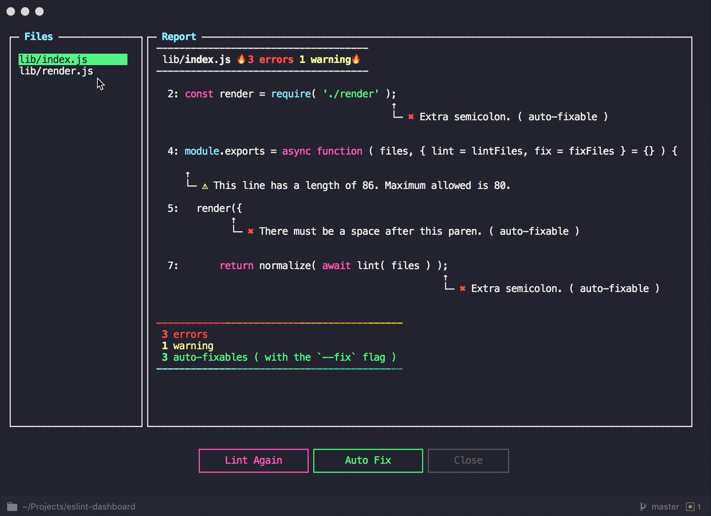

# eslint-dashboard

Dashboard for ESLint report and fix



# Installation

```bash
npm i eslint-dashboard
```

# Usage

```bash
# Run command
eslint-dashboard
```

# API

```js
const dashboard = require( 'eslint-dashboard' )

// files: the same as first parameter of eslint.lintFiles
// lint and fix: the same as `lintFiles` and `fixFiles` in `lib/lint.js`
dashboard( files, {
  lint() {
    // return eslint lint results
  },
  fix() {
    // return eslint fix results
  }
} )
```

# License

MIT
